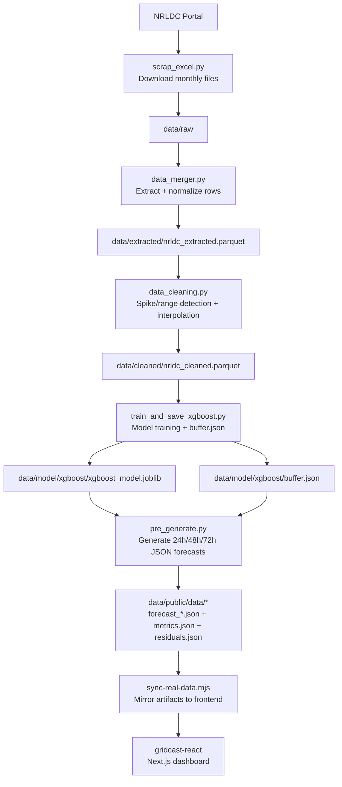
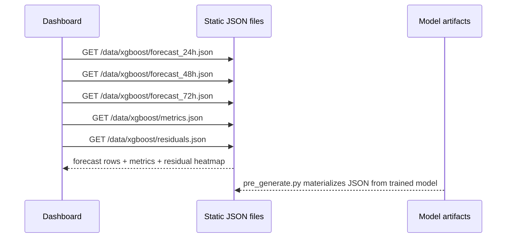
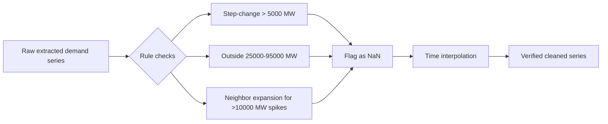

#  GridCast — Smart Grid Load Prediction (Team NavGati)

Production-oriented electricity load forecasting system for smart grids using a **data pipeline + offline-trained models + JSON forecast artifacts + dashboard frontend**.

---


## Table of Contents

1. [Project Overview](#project-overview)
2. [Problem Statement](#problem-statement)
3. [What This Repository Delivers](#what-this-repository-delivers)
4. [Repository Architecture](#repository-architecture)
5. [System Flow (Mermaid)](#system-flow-mermaid)
6. [Tech Stack](#tech-stack)
7. [Data Sources and Data Contracts](#data-sources-and-data-contracts)
8. [Detailed Module and Function Reference](#detailed-module-and-function-reference)
   - [Scraper (`src/scrapping/scrap_excel.py`)](#1-scraper-srcscrappingscrap_excelpy)
   - [Merger (`src/ingestion/data_merger.py`)](#2-merger-srcingestiondata_mergerpy)
   - [Cleaner (`src/ingestion/data_cleaning.py`)](#3-cleaner-srcingestiondata_cleaningpy)
    - [Training and Forecast Publishing (`src/pipeline/xgboost/train_and_save_xgboost.py`, `src/pipeline/pre_generate.py`)](#4-training-and-forecast-publishing-srcpipelinexgboosttrain_and_save_xgboostpy-srcpipelinepre_generatepy)
    - [Forecast JSON Artifacts](#5-forecast-json-artifacts)
    - [Frontend (`gridcast-react/`)](#6-frontend-gridcast-react)
9. [Runbook (End-to-End)](#runbook-end-to-end)
10. [Forecast JSON Contract](#forecast-json-contract)
11. [Modeling Strategy and Metrics](#modeling-strategy-and-metrics)
12. [Model Evaluation & Comparison](#model-evaluation--comparison)
13. [Observability and Logs](#observability-and-logs)
14. [Research and Design Synthesis](#research-and-design-synthesis)
15. [External Research Notes (Web + Context7)](#external-research-notes-web--context7)
16. [Known Constraints](#known-constraints)
17. [Roadmap](#roadmap)
18. [References](#references)

---

## Project Overview

This project builds an AI-assisted forecasting workflow for **short-term electricity demand prediction** in a smart-grid setting (NRLDC-focused workflow in current implementation). It provides:

- Automated historical forecast-file collection from NRLDC web portal
- Structured extraction and cleaning pipeline for 15-minute demand series
- Feature-engineered local training with seasonal holdout validation
- JSON forecast publishing for 24h, 48h, and 72h horizons
- Precomputed residual heatmap for operational reliability analysis
- Next.js dashboard UI that reads static forecast JSON files and displays KPIs, forecasts, and residual patterns

The current serving constraint is file-based rather than API-based: the model is trained on your machine, forecast outputs are materialized as JSON, and the frontend consumes those JSON files directly.

The system is designed as a practical bridge between research-grade forecasting and operations-grade deployment patterns.

---

## Problem Statement

Modern grids must continuously balance supply and demand under volatility from:

- Intraday consumption pattern shifts
- Renewable generation variability
- Operational constraints during peak windows
- Data quality issues (spikes, missingness, inconsistent records)

Static or weak forecasting increases risk of:

- Dispatch inefficiency
- Higher operating cost
- Peak handling stress
- Reduced resilience and reliability

This repository addresses that gap with a reproducible ML pipeline and lightweight serving layer.

---

## What This Repository Delivers

- **Forecast horizon:** 24, 48, and 72 hours ahead at 15-minute granularity (`96`, `192`, and `288` steps)
- **Model family:** XGBoost and LSTM artifacts trained through the project pipeline (season-aware split, autoregressive inference)
- **Data cadence:** 15-minute load points
- **Pipeline stages:** scrape → extract/merge → clean → train → generate JSON forecasts → sync → visualize
- **Model artifacting:** `joblib` model + JSON metadata/buffer + forecast JSON files + metrics/residuals JSON files
- **Operational diagnostics:** residual heatmap over day-of-week × hour-of-day, published as JSON for the dashboard

---

## Repository Architecture

```text
requirements.txt
README.md

data/
|-- raw/                 # downloaded NRLDC files by year/month
|   |-- 2024/
|   |   |-- <month folders by year>
|   |-- 2025/
|   |   |-- <month folders by year>
|   `-- 2026/
|       `-- <month folders by year>
|-- extracted/           # merged extracted parquet
|-- cleaned/             # cleaned parquet used for training
|-- model/
|   |-- xgboost/
|   |   |-- xgboost_model.joblib
|   |   `-- buffer.json
|   `-- lstm/
|       |-- 24h.keras
|       |-- 48h.keras
|       |-- 72h.keras
|       `-- buffer.json
`-- public/
    `-- data/
        |-- xgboost/
        |   |-- forecast_24h.json
        |   |-- forecast_48h.json
        |   |-- forecast_72h.json
        |   |-- metrics.json
        |   `-- residuals.json
        `-- lstm/
            |-- forecast_24h.json
            |-- forecast_48h.json
            |-- forecast_72h.json
            |-- metrics.json
            `-- residuals.json

docs/
|-- design/
|   |-- architecture.md
|   `-- system_design.md
|-- overview/
|   |-- problem_statement.md
|   `-- project_overview.md
|-- research/
|   |-- base_papers.md
|   `-- model_analysis.md
`-- synopsis/
    `-- Synopsis Report-NavGati Updated.pdf

logs/
|-- scrap_excel.log
`-- data_merger.log

notebooks/
|-- 01_eda.ipynb
|-- 02_baseline_models.ipynb
|-- 03_model_comparison.ipynb
|-- 04_xgboost_forecasting.ipynb
|-- 05_lstm_forecasting.ipynb
`-- 06_lstm_model_saving.ipynb

src/
|-- scrapping/
|   `-- scrap_excel.py
|-- ingestion/
|   |-- data_merger.py
|   `-- data_cleaning.py
`-- pipeline/
    |-- pre_generate.py
    `-- xgboost/
        `-- train_and_save_xgboost.py

gridcast-react/
|-- app/
|-- components/
|-- lib/
|-- public/
|   `-- data/
`-- scripts/
    `-- sync-real-data.mjs
```

---

## System Flow (Mermaid)

### 1) End-to-End Pipeline



### 2) Forecast Serving Sequence



### 3) Data Quality Logic



---

## Tech Stack

- **Language:** Python 3.x, JavaScript, HTML/CSS
- **Data:** pandas, pyarrow, fastparquet
- **ML:** xgboost, scikit-learn, numpy, joblib
- **Serving:** JSON artifact publishing plus static file delivery through the frontend
- **Frontend:** Next.js, React, TypeScript, Tailwind CSS
- **Automation:** selenium, webdriver-manager
- **Notebook analysis:** Jupyter notebooks under `notebooks/`

---

## Data Sources and Data Contracts

### Primary operational source

- **NRLDC intraday forecast portal** (`https://nrldc.in/forecast/intra-day-forecast`)
- Downloaded files are grouped as `data/raw/<year>/<month>/...xlsx`

### Research-aligned public benchmark source

- **UCI ElectricityLoadDiagrams20112014** (15-minute consumption benchmark dataset)

### Internal data contracts across pipeline

1. **Extracted parquet** (`data/extracted/nrldc_extracted.parquet`)
   - columns: `date`, `timestamp`, `actual_demand_mw`
2. **Cleaned parquet** (`data/cleaned/nrldc_cleaned.parquet`)
   - datetime index
   - column: `actual_demand_mw`
3. **Model metadata** (`data/model/xgboost/buffer.json`, `data/model/lstm/buffer.json`)
   - `feature_cols`, `test_metrics`, rolling `buffer`, residual heatmap artifacts
4. **Forecast JSON artifacts** (`data/public/data/<model>/forecast_24h.json`, `forecast_48h.json`, `forecast_72h.json`)
   - `generated_at`, `model`, `data_end`, `trained_at`, `horizon`, `steps`, `forecast`
5. **Diagnostics JSON artifacts** (`data/public/data/<model>/metrics.json`, `residuals.json`)
   - `horizon_metrics`, `heatmap_matrix`, `heatmap_flat`, `heatmap_info`

---

## Detailed Module and Function Reference

## 1) Scraper (`src/scrapping/scrap_excel.py`)

### Purpose
Automates NRLDC SPA navigation, iterates year/month folders, downloads files with pagination, and logs run summary.

### Key constants

- `BASE_URL`: target portal
- `BASE_DOWNLOAD_DIR`: local raw-data root
- `TABLE_ID`: DataTable id (`operationsTable`)
- `MONTH_MAP`: month name to integer mapping
- Runtime counters: `_total_files_downloaded`, `_total_files_checked`, `_total_files_skipped`

### Function-by-function details

| Function | Inputs | Returns | What it does | Why it matters |
|---|---|---|---|---|
| `get_driver(download_dir)` | download directory | configured `webdriver.Chrome` | Creates Chrome driver with download prefs and stability flags | Ensures unattended, deterministic downloads |
| `set_download_dir(driver, directory)` | driver, target dir | None | Switches active browser download path via CDP | Supports year/month folder routing |
| `wait_for_downloads(directory, timeout=90)` | folder, timeout | bool | Waits until `.crdownload`/`.tmp` files disappear | Prevents partial-file processing |
| `count_files(directory)` | folder path | int | Counts files in directory | Utility for summary checks |
| `get_existing_files(directory)` | folder path | `set[str]` | Snapshot of existing filenames | Enables skip/new download calculation |
| `wait_table_loaded(wait)` | `WebDriverWait` | None | Waits for DataTable processing spinner to clear | Reduces race conditions with SPA updates |
| `click_btn(driver, el)` | driver, element | None | Scrolls into view + JS click | Improves click reliability in dynamic UI |
| `get_folder_buttons(driver)` | driver | element list | Returns sidebar folder buttons | Base primitive for year/month traversal |
| `find_btn_by_fid(driver, fid)` | driver, folder id | element or None | Finds folder button by `data-folderid` | Stable selector in changing DOM layouts |
| `table_has_no_data(driver)` | driver | bool | Detects “no data/no record” table states | Avoids empty-page download loops |
| `try_set_50_rows(driver)` | driver | bool | Sets DataTable page size to 50 using robust selectors | Reduces pagination overhead |
| `get_download_links(driver)` | driver | `(links, strategy)` | Finds file download anchors using icon/href fallbacks | Handles icon or link-type differences |
| `_find_link_by_href(driver, href, timeout=4)` | driver, href | element or None | Re-locates an anchor after table re-render | Mitigates stale element references |
| `click_download_links(driver, links, existing_files)` | driver, link elements, file set | bool | Bulk-clicks links using re-query + JS fallback | Maximizes download success on dynamic pages |
| `month_is_future(year, month_name)` | year, month text | bool | Filters out future months relative to current date | Prevents invalid scraping targets |
| `open_year(driver, wait, year_fid)` | driver, wait, year folder id | bool | Fresh page load then opens a year accordion | Maintains clean state per year |

### Script-level runtime flow (top-level block)

- Initializes logger and webdriver
- Discovers available year folders
- Iterates years → months (with future-month filter)
- Downloads each page’s files and paginates until exhaustion
- Writes aggregated run summary to `logs/scrap_excel.log`
- Exits non-zero on fatal failure (`sys.exit(1)`)

---

## 2) Merger (`src/ingestion/data_merger.py`)

### Purpose
Parses raw Excel files into a single normalized parquet file for downstream cleaning and model training.

### Function-by-function details

| Function | Inputs | Returns | What it does |
|---|---|---|---|
| `extract_date_from_filename(file_path)` | file path | `pd.Timestamp` | Extracts date token from filename patterns `DD-MM-YYYY` / `DD_MM_YYYY` |
| `extract_nrldc_data(file_path)` | file path | `pd.DataFrame` | Reads one Excel file, fixes headers, selects useful columns, numeric-casts demand, drops non-data rows |
| `main()` | none | None | Scans all `.xlsx` recursively, processes each file, concatenates, de-duplicates, sorts, saves to parquet |

### Output contract

- Writes `data/extracted/nrldc_extracted.parquet`
- Final columns: `date`, `timestamp`, `actual_demand_mw`

---

## 3) Cleaner (`src/ingestion/data_cleaning.py`)

### Purpose
Applies physically grounded anomaly detection and interpolation repair to demand time series.

### Domain thresholds used

- `STEP_THRESHOLD = 5000` MW (15-min step-change)
- `LOW_BOUND = 25000` MW
- `HIGH_BOUND = 95000` MW
- `LARGE_SPIKE = 10000` MW (neighbor-expansion trigger)

### Function-by-function details

| Function | Inputs | Returns | What it does |
|---|---|---|---|
| `load_dataset(path)` | parquet path | DataFrame (datetime index) | Creates datetime index from `date + timestamp`, sorts, deduplicates index |
| `detect_bad_points(series)` | load series | `(mask, n_step, n_range, n_neighbour)` | Flags impossible jumps/range breaches and expands neighbors for large spikes |
| `repair(df, bad_mask)` | dataframe, bool mask | `(clean_df, remaining_nulls)` | Nulls flagged points and fills with time interpolation |
| `verify(df_clean)` | cleaned dataframe | None | Re-runs checks and prints post-clean status |

### Script behavior

- Loads extracted parquet
- Detects anomalies
- Repairs series
- Verifies residual anomalies
- Saves cleaned output to `data/cleaned/nrldc_cleaned.parquet`

---

## 4) Training and Forecast Publishing (`src/pipeline/xgboost/train_and_save_xgboost.py`, `src/pipeline/pre_generate.py`)

### Purpose
Builds model-ready features, performs season-aware split, trains XGBoost, evaluates, computes residual heatmap, and then publishes JSON forecast artifacts for the frontend.

### Key constants

- `BUFFER_LEN = 672` (1 week of 15-min history)
- `HORIZONS = {"24h": 96, "48h": 192, "72h": 288}`
- `HOLDOUT_MONTHS = 3`

### Function-by-function details

| Function | Inputs | Returns | What it does |
|---|---|---|---|
| `add_features(df_part, full_series)` | partition df, full target series | engineered df | Adds lag features, rolling statistics, and calendar features |
| `make_split(df)` | full df | `(train_mask, test_mask, cutoff)` | Time/season-aware split with last 3 months as holdout |
| `evaluate(y_true, y_pred, label='')` | true and predicted arrays | metrics dict | Computes MAE, RMSE, MAPE |
| `forecast_from(cutoff_idx, series, model, feature_cols)` | cutoff index, series, model, feature order | `(pred_index, preds, actuals)` | 96-step autoregressive forecasting loop from a single cutoff |
| `compute_residual_heatmap(series, model, feature_cols, test_start_idx)` | series, model, features, test start index | `(matrix, flat_list)` | Runs repeated cutoffs over test period and computes mean APE by day/hour bucket |
| `run_xgb_forecast(horizon, model, buffer_meta)` | horizon, model, buffer metadata | prediction list | Generates 24h/48h/72h autoregressive forecasts |
| `save_json(preds, horizon, model_name, buffer_meta)` | forecast list, horizon, model name, metadata | JSON payload dict | Shapes the prediction payload for file-based publishing |

### Artifact outputs

- `data/model/xgboost/xgboost_model.joblib`
- `data/model/xgboost/buffer.json` containing:
  - model metadata (`trained_at`, `data_end`, `feature_cols`)
  - `test_metrics`
  - last 672 observed loads (`buffer`)
  - residual heatmap (`heatmap_matrix`, `heatmap_flat`, `heatmap_info`)
- `data/public/data/xgboost/forecast_24h.json`, `forecast_48h.json`, `forecast_72h.json`
- `data/public/data/xgboost/metrics.json`
- `data/public/data/xgboost/residuals.json`

The LSTM pipeline follows the same publishing contract under `data/public/data/lstm/`.

---

## 5) Forecast JSON Artifacts

### Purpose
The forecast is not served by a live inference API in the current setup. Instead, `src/pipeline/pre_generate.py` loads the saved model artifacts, generates 24h/48h/72h predictions, and writes ready-to-consume JSON files for the frontend.

### Generated files

| File | Purpose |
|---|---|
| `forecast_24h.json` | 96-step forecast for the next 24 hours |
| `forecast_48h.json` | 192-step forecast for the next 48 hours |
| `forecast_72h.json` | 288-step forecast for the next 72 hours |
| `metrics.json` | Horizon metrics and training timestamps |
| `residuals.json` | 7×24 residual heatmap data |

### Runtime notes

- Files are written to `data/public/data/<model>/` and mirrored into `gridcast-react/public/data/<model>/`
- The frontend reads these files directly, so there is no mandatory always-on Flask service
- `gridcast-react/scripts/sync-real-data.mjs` validates that the required JSON artifacts exist after sync

---

## 6) Frontend (`gridcast-react/`)

### Purpose
Next.js dashboard that reads the generated JSON artifacts from `public/data`, renders operational forecast views, KPIs, model comparison, residual heatmap, and CSV export.

### JavaScript function reference

| Function | Inputs | Returns | Responsibility |
|---|---|---|---|
| `fmt(n)` | number | localized string | Integer formatting for display |
| `fmtMW(n)` | number | string | Adds `MW` unit suffix |
| `mapeClass(v)` | number | class token | Maps MAPE to `good/warn/bad` styling |
| `nowIST()` | none | string | Current IST time string |
| `loadForecast()` | none | Promise | Fetches `public/data/<model>/forecast_*.json`, `metrics.json`, and `residuals.json` and triggers render |
| `refreshForecast()` | none | None | Manual refresh hook |
| `renderAll(health, data)` | JSON payloads | None | Updates all dashboard sections from latest data |
| `drawForecastChart(fc, peak, peakIdx)` | forecast list + peak metadata | None | Draws SVG line + confidence band + tooltip behaviors |
| `buildHeatmap(matrix)` | 7×24 matrix or null | None | Renders real residual heatmap or static fallback |
| `exportCSV()` | none | None | Exports forecast rows as CSV file |
| `setupNavTabs()` | none | None | Handles tab switching between Forecast/Analysis/Models/Reports |

### UI interaction model

- On load: `setupNavTabs(); loadForecast();`
- Error handling: Shows a data-loading banner when the JSON artifacts are missing or stale
- Progressive enhancement: if `/residuals.json` is unavailable, uses fallback heatmap

---

## Runbook (End-to-End)

## 1) Install dependencies

```bash
pip install -r requirements.txt
cd gridcast-react
npm install
```

## 2) Run data ingestion

```bash
python src/scrapping/scrap_excel.py
python src/ingestion/data_merger.py
python src/ingestion/data_cleaning.py
```

## 3) Train the model on your machine

```bash
python src/pipeline/xgboost/train_and_save_xgboost.py
```

## 4) Generate forecast JSON artifacts

```bash
python src/pipeline/pre_generate.py
```

## 5) Sync artifacts to the frontend

```bash
cd gridcast-react
npm run sync:data
```

## 6) Open frontend

```bash
cd gridcast-react
npm run dev:real
```

Open `http://localhost:3000` in your browser.

---

## Forecast JSON Contract

### `forecast_24h.json`, `forecast_48h.json`, `forecast_72h.json`

Each forecast artifact contains:

- `generated_at`
- `model`
- `data_end`
- `trained_at`
- `horizon`
- `horizon_h`
- `steps`
- `horizon_metrics`
- `forecast` array with timestamped values:
  - `datetime` (string)
  - `load_mw` (number)

### `metrics.json`

Contains:

- `trained_at`
- `data_end`
- `horizon_metrics`

### `residuals.json`

- `heatmap_matrix` (`7x24`, day-of-week × hour)
- `heatmap_flat` (168 values)
- `heatmap_info`
- `trained_at`
- `data_end`

---

## Modeling Strategy and Metrics

### Model strategy in this implementation

- Feature-rich autoregressive regression with XGBoost
- Season-aware holdout (last 3 months) to test temporal generalization
- Sliding-cutoff residual analysis for operational reliability map

### Metrics tracked

- **MAE** (absolute error magnitude)
- **RMSE** (penalizes larger misses)
- **MAPE** (relative error)

### Why this is deployment-friendly

- Fast inference
- Explainable lag/calendar feature set
- Artifact-based serving (no online retrain dependency)
- File-based publishing avoids keeping a prediction server online

---

## Model Evaluation & Comparison

### Dataset & Training Setup

- **Data Duration:** April 2024 to March 2026 (~59,000 rows, 15-minute intervals)
- **Features Used:** 7 cyclic features (load + time-based: hour, day of week, month)
- **LSTM Sequence Length:** 192 (past 48 hours of historical data)

### LSTM v2 Performance by Horizon

| Horizon | Avg MAPE | Status |
|---------|----------|--------|
| 24h     | 2.30%    | Strong and stable |
| 48h     | 2.31%    | Slight degradation |
| 72h     | 2.99%    | Noticeable drop |

**Training Insights:**
- Early stopping triggered between epochs 6–9
- Learning rate reduced multiple times, indicating quick convergence
- Model showed signs of learning strong seasonal patterns with limited model complexity

### Head-to-Head Comparison: XGBoost vs LSTM v2

| Horizon | XGBoost | LSTM v2 | Delta  | Winner    |
|---------|---------|---------|--------|-----------|
| 24h     | 1.69%   | 2.30%   | +0.61% | XGBoost   |
| 48h     | 2.11%   | 2.31%   | +0.20% | XGBoost   |
| 72h     | 2.74%   | 2.99%   | +0.25% | XGBoost   |

### Key Findings

**1. XGBoost Superiority**
- Consistently outperforms LSTM across all forecast horizons
- Well-suited for structured/tabular data with engineered features
- Maintains stability and accuracy even at 72-hour horizon

**2. LSTM Limitations**
- Only basic time-based features utilized
- Missing important external variables: weather data, holidays, demand anomalies
- Prevents effective exploitation of temporal dependencies

**3. Long-Horizon Forecast Challenge (72h)**
- Significant error increase observed across both models
- Instability in later backtest windows
- Indicates inherent difficulty in extended forecasting

### Deployment Recommendation

**Primary Model: XGBoost**
- Production deployment due to superior accuracy and stability
- Easier maintenance and explainability
- Consistent performance across all horizons
- Error remains under 3%, meeting industry-standard requirements

**Secondary Use: LSTM**
- Suitable for research and experimentation
- Foundation for future hybrid or ensemble models
- Opportunity for enhancement with external feature integration

---

## Observability and Logs

- `logs/scrap_excel.log`: scraping execution summary and failures
- `logs/data_merger.log`: extraction/merge completion summaries
- Training and JSON generation scripts print model metadata, training time, and data end timestamp
- The frontend sync script fails fast if a required JSON artifact is missing

Suggested production add-ons:

- Structured JSON logging
- Request/latency metrics for API endpoints
- Scheduled retraining and drift alerting

---

## Research and Design Synthesis

Based on `docs/overview/project_overview.md`, `docs/design/system_design.md`, and `docs/research/model_analysis.md`, the project direction combines:

- Time-series forecasting for grid stability
- Data engineering rigor (validation, cleaning, feature pipelines)
- ML/DL comparative approach (Linear/GRU/LSTM/XGBoost references)
- Operational objective alignment (peak-risk mitigation, reliability, sustainability)

Design patterns reflected in code:

- Modular pipeline stages
- Artifact-based model lifecycle
- Monitoring-oriented residual diagnostics
- Static artifacts + dashboard for applied decision support

> Note: `docs/synopsis/Synopsis Report-NavGati Updated.pdf` is included in repository documentation scope but is not machine-parsed in this README generation flow.

---

## External Research Notes 

### Grid context (web research)

- IEA report emphasis: grids are central to secure clean-energy transitions, and planning/management upgrades are critical to avoid grid bottlenecks.
- U.S. DOE grid modernization framing: smarter, data-enabled grids improve resilience, outage response, renewable integration, and operational efficiency.
- UCI electricity load benchmark confirms broad use of 15-minute cadence load data for forecasting tasks.

### Library guidance (Context7)

- **XGBoost (`/dmlc/xgboost`)**: strong fit for tabular time-series feature sets, scikit-learn style `XGBRegressor`, robust parameterization and importance analysis.
- **Next.js / static hosting**: standard public-asset patterns for serving forecast JSON files directly to the dashboard.
- **Pandas (`/pandas-dev/pandas`)**: DatetimeIndex-first operations and `interpolate(method='time')` align with this project’s cleaning path.

---

## Known Constraints

- Scraper relies on target portal DOM stability; UI changes may require selector updates.
- No formal test suite is currently present.
- Current pipeline is single-region operationalized (North) though docs discuss multi-region ambitions.
- The dashboard consumes static artifacts; online updates require explicit retraining and re-syncing of JSON files.

---

## Roadmap

1. Add weather/exogenous features for peak-window robustness.
2. Add model registry and retraining scheduler.
3. Add CI tests for pipeline invariants and forecast JSON contracts.
4. Add region abstraction for North/South/East/West scaling.
5. Integrate LSTM/GRU pipeline as optional model backend.

---

## References

### Repository documentation

- `docs/overview/project_overview.md`
- `docs/overview/problem_statement.md`
- `docs/design/architecture.md`
- `docs/design/system_design.md`
- `docs/research/base_papers.md`
- `docs/research/model_analysis.md`
- `docs/synopsis/Synopsis Report-NavGati Updated.pdf`

### External

- IEA — Electricity Grids and Secure Energy Transitions: https://www.iea.org/reports/electricity-grids-and-secure-energy-transitions
- U.S. DOE — Grid Modernization and the Smart Grid: https://www.energy.gov/oe/activities/technology-development/grid-modernization-and-smart-grid
- UCI ML Repository — ElectricityLoadDiagrams20112014: https://archive.ics.uci.edu/dataset/321/electricityloaddiagrams20112014
- XGBoost docs (Context7 index): `/dmlc/xgboost`
- Flask docs (Context7 index): `/pallets/flask`
- Pandas docs (Context7 index): `/pandas-dev/pandas`

---

## Quick Start (minimal)

```bash
pip install -r requirements.txt
python src/scrapping/scrap_excel.py
python src/ingestion/data_merger.py
python src/ingestion/data_cleaning.py
python src/pipeline/xgboost/train_and_save_xgboost.py
python src/pipeline/pre_generate.py
cd gridcast-react
npm install
npm run sync:data
npm run dev:real
```

Then open dashboard:

- `http://localhost:3000`

---


